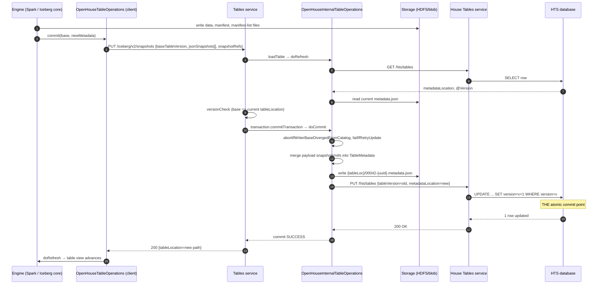

# The OpenHouse Table Commit Protocol

An OpenHouse table commit is atomic at exactly one point: a single optimistic-locked row
update in the House Tables service's database. Everything else in the protocol — the
metadata.json write, the three layered base checks, the disabled server-side retries —
exists either to feed that row update or to protect it from stale writers. The "version"
that clients and services exchange is not a number: it is the storage path of the
table's previous `metadata.json`, used as a compare-and-swap token at three layers, and
the only true monotonically increasing number is the JPA `@Version` column on the House
Tables row. The protocol's structural weakness is that the client is authoritative over
the table's *entire* snapshot list, so correctness depends entirely on those base
checks; when one gap in them was found, the result was a silently dropped, durably
committed snapshot in production ([Appendix A](appendix-a-snapshot-drop-bug.md)).

This document explains the protocol as it exists today, at repo commit `2a9dac8`. Line
numbers reference that commit. Companion documents: the incident case study
([Appendix A](appendix-a-snapshot-drop-bug.md)), the code review of this path
([Appendix B](appendix-b-code-review.md)), Apache Iceberg's native commit protocol for
comparison ([Appendix C](appendix-c-iceberg-commit-protocol.md)), the design for moving
to a REST-catalog-native commit ([Appendix D](appendix-d-rest-native-migration.md)),
and a TLA+ model of this protocol ([Appendix E](appendix-e-tla.md)).

## 1. The protocol in one screen

Three layers participate in a commit. Two of them implement Iceberg's `TableOperations`
interface — one in the client engine, one inside the Tables service — and the bottom
layer is a plain JPA row store:

| Layer | Catalog / operations classes | Role in a commit |
|---|---|---|
| Client (Spark/Java engine) | `OpenHouseCatalog`, `OpenHouseTableOperations` (`integrations/java/iceberg-1.2/openhouse-java-runtime/.../javaclient/`) | Builds the new `TableMetadata`, writes data/manifest files directly to storage, sends the commit as a REST request carrying the full snapshot list |
| Tables REST service | `OpenHouseInternalCatalog`, `OpenHouseInternalTableOperations` (`iceberg/openhouse/internalcatalog/...`), fronted by `OpenHouseInternalRepositoryImpl` (`services/tables/...`) | Validates the writer's base, rebuilds `TableMetadata` server-side, writes the new `metadata.json`, calls HTS |
| House Tables service (HTS) | `UserTablesServiceImpl`, `UserTableRow` (`services/housetables/...`) | Owns the authoritative pointer row; its optimistic-locked UPDATE is the commit point |

The happy path, end to end (the diagram below and
[sequence-diagram.puml](sequence-diagram.puml) render the same steps):

1. The engine finishes writing data files, builds a new snapshot, and calls
   `TableOperations.commit(base, newMetadata)`; the client sends
   `PUT .../iceberg/v2/snapshots` carrying `baseTableVersion` (the base metadata.json
   path) and the **entire** serialized snapshot list plus refs.
2. The Tables service loads the table (refreshing the pointer from HTS), pre-checks the
   declared base, and stages the payload as table properties on an Iceberg transaction.
3. `OpenHouseInternalTableOperations.doCommit` re-checks the base (the fix-#612 CAS),
   reconciles the payload's snapshot list against current metadata, and writes a new
   uniquely-named `metadata.json` to the table root.
4. The Tables service asks HTS to update the table's row; HTS verifies the declared
   base a third time and issues `UPDATE ... WHERE version = v` — Hibernate's optimistic
   lock. This single row update is the atomic commit point.
5. Success propagates back; the client refreshes and sees its own commit. Any loser of
   the race gets HTTP 409, which the client maps to `CommitFailedException` so the
   engine's Iceberg retry loop refreshes and reapplies the operation.

## 2. What "version" actually means

Three version-like artifacts exist; only one is the real concurrency guard. Any
discussion of "the table version" must first disambiguate among these:

| # | Artifact | What it is | Where it lives | Checked by |
|---|---|---|---|---|
| V1 | `tableVersion` / `baseTableVersion` | The **path string** of the previous metadata.json (`"INITIAL_VERSION"` sentinel on create) | Request bodies; table property `openhouse.tableVersion`; HTS row column | Three comparisons — see below |
| V2 | `UserTableRow.version` | JPA `@Version Long` — the only true monotonic counter | HTS database row (`UserTableRow.java:28`) | Hibernate's `UPDATE ... WHERE version = v` |
| V3 | `int version = currentVersion() + 1` | Ordinal count of metadata files, used only in the `%05d-` file-name prefix | `OpenHouseInternalTableOperations.java:258` | Nothing — uniqueness comes from the UUID suffix |

V1 is generated implicitly: it *is* the previous commit's metadata location. The client
stamps it from its own base (`OpenHouseTableOperations.java:208-209, 369-370`), and it
is compared at three layers, in request order:

1. **Advisory pre-check** — `versionCheck`
   (`OpenHouseInternalRepositoryImpl.java:451-475`): request `tableVersion` vs the
   loaded table's `openhouse.tableLocation` property, scheme-normalized. Runs at
   request-validation time against the writer's own loaded view, so it cannot see a
   race that lands afterward.
2. **Catalog CAS** — `abortIfWriterBaseDivergedFromCatalog`
   (`OpenHouseInternalTableOperations.java:604-635`): the writer's declared base
   (travelling as the `commitKey` table property) vs `base.metadataFileLocation()` as
   of the server's refresh, URI-normalized. Added by fix #612; closes the silent-rebase
   window described in [Appendix A](appendix-a-snapshot-drop-bug.md).
3. **Authoritative check** — `UserTableVersionMapper.toVersion`
   (`services/housetables/.../UserTableVersionMapper.java:20-47`): request
   `tableVersion` vs the stored row's `metadataLocation` (raw string compare). On
   match, the existing row's `@Version` is carried onto the new entity, and the
   subsequent JPA save becomes `UPDATE ... WHERE version = v` — the one atomic
   arbiter (V2). A concurrent winner makes the UPDATE match zero rows →
   `ObjectOptimisticLockingFailureException` → HTTP 409.

The end-to-end concurrency model is therefore: *string-equality prechecks on the
metadata pointer, backed by a database optimistic lock as the single atomic arbiter*.
Checks 1 and 2 are pure fast-fail optimizations plus one correctness role: check 2 is
what prevents a silently rebased writer from reaching HTS with a payload whose declared
base still matches the row (the #612 bug class), because HTS compares only the declared
base string, not the payload's freshness.

## 3. Commit control flow in detail

### 3.1 Client side

`OpenHouseTableOperations.doCommit` (`OpenHouseTableOperations.java:142-169`) routes on
what changed: snapshots plus metadata on an existing table → `putSnapshotsForReplace`;
snapshots only → `commitSnapshots` → `PUT .../iceberg/v2/snapshots`; metadata only →
`PUT .../tables/{table}`. Both request shapes carry `baseTableVersion`, and the
snapshots body carries the **full final snapshot list** — every snapshot of the new
metadata serialized via `SnapshotParser.toJson` — plus the full refs map
(`OpenHouseTableOperations.java:364-391`). The payload is declarative absolute state,
not a delta; the significance of that choice appears in §5.

The client never writes `metadata.json`. It writes data files, manifests, and manifest
lists directly to storage before the REST call, and it reads `metadata.json` directly
from storage on refresh (`doRefresh`, `OpenHouseTableOperations.java:97-128`); the REST
service hands out only the pointer.

HTTP status → Iceberg exception mapping on the client
(`OpenHouseTableOperations.java:418-464`) drives the engine's behavior:

| Status | Client exception | Engine behavior |
|---|---|---|
| 409 | `CommitFailedException` | Refresh and reapply via Iceberg's retry loop |
| 500 / 503 / 504, or no response | `CommitStateUnknownException` | Stop; do **not** clean up written files; surface to the application |
| 404 | `NoSuchTableException` | Fail |
| 400 | `BadRequestException` | Fail |

The 5xx mapping is deliberate: an ambiguous outcome must not trigger file cleanup,
because the commit may have succeeded server-side.

### 3.2 Tables service

The controller/handler/service chain
(`IcebergSnapshotsController.java:41-66` → `IcebergSnapshotsServiceImpl.java:36-110`)
performs authorization and lock checks, then maps the request into a `TableDto` whose
`tableVersion` holds the declared base. `OpenHouseInternalRepositoryImpl.save`
(`OpenHouseInternalRepositoryImpl.java:111-226`) then:

1. Loads the table (`catalog.loadTable` → `doRefresh` → HTS `findById` → read
   metadata.json from storage) and opens an Iceberg transaction on it.
2. Runs `versionCheck` (§2, check 1).
3. Stages the payload **as table properties on the transaction**: serialized snapshots
   under `snapshotsJsonToBePut`, refs under `snapshotsRefs`, the declared base under
   `commitKey`, plus evolved schemas, user properties, and policies
   (`OpenHouseInternalRepositoryImpl.java:187-196`). Snapshots ride *inside table
   properties* through Iceberg's transaction machinery — a load-bearing quirk of this
   protocol.
4. Forces `commit.num-retries=0` (`OpenHouseInternalRepositoryImpl.java:201-207`) so
   the server-side Iceberg transaction never auto-retries. A server-side retry would
   silently rebase the client's stale payload onto a concurrent winner — precisely the
   #612 failure mode — so the only sanctioned retry loop is the engine's, which
   recomputes the payload from a fresh base.
5. Calls `transaction.commitTransaction()`, which lands in
   `OpenHouseInternalTableOperations.doCommit`.

### 3.3 Server catalog: `doCommit`

`OpenHouseInternalTableOperations.doCommit`
(`OpenHouseInternalTableOperations.java:250-489`) executes, in order:

1. Schema processing (`processSchemas`, `:686-718`).
2. New metadata path: `{tableLocation}/%05d-%s.metadata.json` — ordinal prefix (V3)
   plus a random UUID, so concurrent writers can never collide on a path (`:191-201`).
3. `abortIfWriterBaseDivergedFromCatalog` (§2, check 2) — must run before
   `failIfRetryUpdate`, which strips `commitKey` from the properties.
4. `failIfRetryUpdate` (`:642-664`): an in-JVM Guava cache (5-minute TTL, max 1000
   entries) of seen `commitKey`s. A repeated key means some internal retry re-submitted
   the same user commit; the protocol rejects it with `CommitFailedException` and tells
   the application to retry from a fresh base. The cache is per-instance and the key is
   burned *before* the commit succeeds — consequences in
   [Appendix B](appendix-b-code-review.md).
5. Property bookkeeping: `openhouse.tableVersion` ← previous location,
   `openhouse.tableLocation` ← new location (`:274-278`); transport-only keys stripped.
6. Snapshot reconciliation (§5).
7. Write the new metadata.json (`TableMetadataParser.write`, `:356-383`) and seed the
   metadata cache.
8. Persist the pointer: map properties into a `HouseTable` row and call
   `houseTableRepository.save` (`:401-411`) — or `rename` for rename commits; staged
   (WAP) tables skip HTS entirely (`:412-419`).
9. Translate failures (`:424-476`): HTS 409 → `CommitFailedException`; HTS 5xx falls to
   the generic `Throwable` handler, which runs Iceberg's `checkCommitStatus` to
   classify the outcome as SUCCESS, FAILURE, or UNKNOWN → `CommitStateUnknownException`
   for the last. Stale-sequence-number `ValidationException`s are reclassified as
   retriable 409s (`isStaleSnapshotError`, `:670-675`).

### 3.4 HTS

`UserTablesServiceImpl.putUserTable` (`UserTablesServiceImpl.java:98-127`) reads the
current row, delegates version resolution to `UserTableVersionMapper` (§2, check 3),
and saves via Spring Data JPA. `ObjectOptimisticLockingFailureException` and friends
map to `EntityConcurrentModificationException` → HTTP 409. Writes are never retried by
the HTS client (`HouseTableRepositoryImpl.java:58-61`); an ambiguous write stays
ambiguous rather than risking a duplicate CAS attempt.

## 4. Atomicity and failure windows

The commit point is the HTS row UPDATE — a single DB transaction guarded by the
`@Version` optimistic lock. Nothing before it is visible to readers; nothing after it
can undo it. The metadata.json write is write-ahead: the file is unreachable garbage
until the row points at it, and its UUID name means concurrent writers cannot collide.
There is no two-phase coordination, and none is needed — with one exception (S6 below),
failure at any step leaves either no change or invisible garbage:

| # | Crash / failure after... | Result |
|---|---|---|
| S1 | Refresh (HTS read + metadata.json read) | No state change; request fails 5xx |
| S2 | Validations (checks 1–2, `failIfRetryUpdate`) | Same — but the commitKey is already burned in that JVM's dedup cache, so a same-instance engine retry from the same base gets a spurious 409 and must rebase |
| S3 | metadata.json written to storage | **Orphan metadata file.** HTS still points at the old file; readers unaffected; maintenance cleans it |
| S4 | HTS call in flight | *The ambiguous window.* HTS 409 → clean loss, engine retries. HTS 5xx/timeout → `checkCommitStatus` re-reads the pointer: confirmed success → SUCCESS; provably absent → `CommitFailedException`; otherwise `CommitStateUnknownException` → 503 → client keeps files, application decides |
| S5 | HTS row updated (**the commit point**) | Commit durable. A crash before the HTTP response reaches the client → `CommitStateUnknownException`; a later client retry from the old base gets a clean 409 |
| S6 | Post-commit extras | Replicated-create rewrites the just-committed metadata.json **in place** (`MetadataUpdateUtils.java:37-59`, `fs.create(path, true)`); a crash mid-rewrite corrupts the committed pointer's target. The one true non-atomic mutation of committed state in the protocol — see [Appendix B](appendix-b-code-review.md) |

Special paths that deviate from the main flow:

- **Stage-create / stage-replace (write-audit-publish)**: metadata.json is written but
  HTS is never updated; the "table" exists only as a file until a later real commit
  (`OpenHouseInternalTableOperations.java:412-419`).
- **Rename**: routes to a direct JPQL UPDATE that neither checks nor bumps `@Version`
  (`UserTableHtsJdbcRepository.java:115-125`) — it bypasses the optimistic lock
  entirely.
- **Drop**: deletes the HTS row first, then purges files; a crash between the two
  leaks the data directory but corrupts nothing.

## 5. Snapshot reconciliation: the subtractive merge

The payload's snapshot list is authoritative. `doCommit`
(`OpenHouseInternalTableOperations.java:314-354`) reconciles it against current
metadata by set difference:

1. Payload snapshots not in current metadata are **added**.
2. Current snapshots not in the payload are **removed** (`builder.removeSnapshots`).
3. Refs are synced wholesale: refs absent from the payload are removed, payload refs
   are set.

The removal branch is how snapshot expiration is expressed through the same endpoint —
and equally how a stale payload silently expires other writers' snapshots if the base
checks fail to catch it. The server trusts the serialized snapshot JSON wholesale: no
existence or ownership validation of the referenced manifest lists is performed
(`SnapshotsUtil.java:45-47` accepts a `FileIO` it never uses). The *only* defense for
the entire snapshot set is the base-check trio of §2. That is the protocol's sharpest
edge, and it is not theoretical: [Appendix A](appendix-a-snapshot-drop-bug.md) traces
the production incident in which Iceberg's `BaseTransaction.applyUpdates` silently
rebased a stale payload past checks 1 and 3, and the subtractive merge expired a
durably committed racing snapshot. Fix #612 added check 2 specifically to convert that
silent loss into a retriable 409. By contrast, Iceberg's native protocol ships typed
change commands that are reapplied onto the current base on every retry, making a
stale-list overwrite structurally impossible
([Appendix C](appendix-c-iceberg-commit-protocol.md), §2;
[Appendix D](appendix-d-rest-native-migration.md) builds on exactly that property).

## 6. Conflict and retry semantics

Two writers committing from the same base both pass the client-side checks, both may
pass checks 1–2 (the race can land after the server's refresh), and both write their
metadata.json files — safely, to different UUID paths. The first HTS row update wins;
the second matches zero rows and unwinds as: HTS 409 →
`HouseTableConcurrentUpdateException` → `CommitFailedException` → Tables service 409 →
client `CommitFailedException` → the engine's Iceberg retry loop refreshes, reapplies
the operation onto the winner's metadata, and resubmits with a new declared base.

Of the three retry loops that could exist, the protocol deliberately collapses to one:

| Loop | Status | Why |
|---|---|---|
| Engine-side Iceberg retry (`commit.retry.num-retries`, default 4) | The only sanctioned loop | It recomputes the payload from a fresh base, which is the only correct response to a conflict when the payload is absolute state |
| Server-side Iceberg transaction retry | Disabled (`commit.num-retries=0`) and poisoned (`failIfRetryUpdate`) | A server-side reapply would rebase the client's payload without the client's knowledge |
| HTS client write retry | Never retries | An ambiguous write must stay ambiguous; a blind retry could double-apply the CAS |

## 7. Properties and limits

The protocol, working as designed, provides per-table linearizable commits: the HTS
row's optimistic lock totally orders commits, and each commit's declared base must name
its predecessor. Within that envelope:

1. **Conflict granularity is whole-table.** Any two concurrent commits conflict,
   regardless of logical independence (a property change conflicts with an append).
   Iceberg's REST protocol conflicts only on asserted requirements
   ([Appendix C](appendix-c-iceberg-commit-protocol.md), §4.2).
2. **The client is trusted with absolute state.** The full-snapshot-list payload makes
   the base-check trio load-bearing for correctness, not just for progress (§5).
3. **Ambiguity is surfaced, not resolved.** There is no commit idempotency token; an
   ambiguous outcome reaches the application as `CommitStateUnknownException`, and
   resolution is manual. Iceberg's REST protocol shares this gap.
4. **Some paths sit outside the protocol's guarantees**: rename (no optimistic lock),
   replace/stage-create (no `commitKey`, deliberately authoritative over the snapshot
   set), and the replicated-create in-place rewrite (mutation of committed state).
   These are enumerated with severity assessments in
   [Appendix B](appendix-b-code-review.md).

The migration design in [Appendix D](appendix-d-rest-native-migration.md) evaluates
moving this protocol to the Iceberg REST-catalog-native model — the catalog service as
the single writer of metadata.json, commits expressed as typed requirements plus
updates — which eliminates limits 1 and 2 structurally while keeping the HTS row CAS as
the atomic arbiter.
